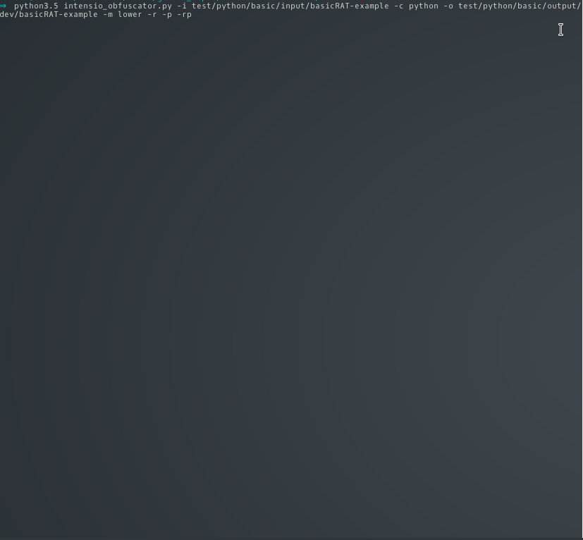

# Intensio-Obfuscator (Beta)

## What is this ?
- Intensio-Obfsucator tool takes a python source code and transform it into an obfuscated python code
  - **Replace** all names of `variables/classes/functions/files-name` to random strings with length defined and all `chars` to their hexadecimal value
  - **Remove** all `commentaries`, all `lines breaks` and all `print()` functions
  - **Add** to each line a random `scripts` with an always differents values

## Requirements
- Python >= 3.5
- requirements.txt

## Files supported
- Files written in python 2.x and 3.x 

## Installation
`git clone https://github.com/Hnfull/Intensio-Obfuscator.git`

`pip3 install -r Intensio-Obfuscator/requirements.txt`

`cd Intensio-Obfuscator/intensio/`

`python3.x intensio_obfuscator.py --help`

## Features
| Features | Descriptions |
| ------ | ------ |
| Replace strings to strings mixed | Replace all names of variables/classes/functions to random strings with length defined and remove all line breaks |
| Paddings scripts | Add random scripts after each line and remove all line breaks |
| Remove commentaries | Remove all commentaries (this feature is executed by default) and all line breaks |
| Remove print | Remove all print functions and all line breaks |
| Replace strings to hex | Replace all chars to their hexadecimal value and all line breaks |
| Replace files name | Replace all files name to random strings with length defined and all line breaks |
| Mixerlevel lower | Generate random strings of 32 chars when `--replacetostr` or `--paddingscripts` or `--replacetohex` or `--replacefilesname` features are specified |
| Mixerlevel medium | Generate random strings of 64 chars when `--replacetostr` or `--paddingscripts` or `--replacetohex` or `--replacefilesname`features are specified |
| Mixerlevel high | Generate random strings of 128 chars when `--replacetostr` or `--paddingscripts` or `--replacetohex` or `--replacefilesname` features are specified |

- `Replace strings to strings mixed`, `Padding scripts`, `Remove print`, `Replace strings to hex`, `Replace files name` features can be executed separatly

## Usages
| Parameters | Descriptions |
| ------ | ------ |
| -h, --help | show this help message and exit |
| -i, --input  | source directory - indicate a directory that contain your file(s) |
| -c, --code | language used in input directory, default value: [python], possible value: [python] |
| -o, --output | output directory that will be obfuscated - indicate a empty directory that will contain your file(s) |
| -m, --mixerlevel | generate random strings of [lower:32 - medium:64 - high:128] chars when `--replacetostr` or `--paddingscripts` or `--replacetohex` features are specified, default value: [medium], possible values: [lower - medium - high]|
| -rts, --replacetostr | activate the `replace strings to strings mixed` obfuscation feature |
| -ps, --paddingscripts | activate the `padding scripts` obfuscation feature |
| -rc, --removecommentaries | activate the `remove commentaries` obfuscation feature (this feature is executed by default) |
| -rp, --removeprint | activate the `remove print` obfuscation feature |
| -rth, --replacetohex | activate the `replace strings to hex` obfuscation feature |
| -rfn, --replacefilesname | activate the `replace files name` obfuscation feature |
| -v, --verbose | improve verbosity |

- **Read these Documentations before to use Intensio-Obfuscator tool**
    - [Steps of usage](docs/steps_usage/python_steps_usage.md)
    - [Recommendations](docs/recommendations/python_code_recommendations.md)
    - [Malfunctions](docs/malfunctions/python_code_malfunctions.md)

## Examples
- [Python target files](docs/examples/python_code_examples.md)

## Demo

## Todo
- Version 1.0.1-x:
    - Code optimization
    - Fix bugs and problems
    - Improved features already present
    - See the enchancement in the section issue
    
- Version 1.1.0-x:
    - Stable version

## License
- MIT

## Disclamer
- Intensio-Obfuscator is for education/research purposes only. The author takes NO responsibility ay for how you choose to use any of the tools provided
