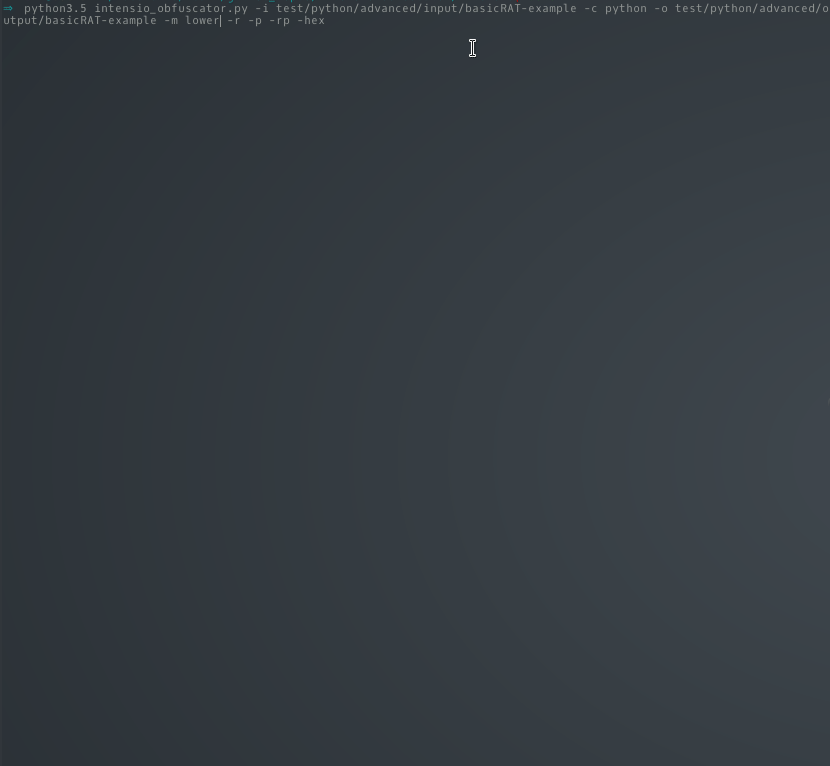

# Intensio-Obfuscator (Beta)

## What is this ?
- Intensio-Obfsucator tool takes a python source code and transform it into an obfuscated python code
  - **Replace** name of variables/classes/functions to random chars and defined length & all chars to their hexadecimal value
  - **Remove** commentaries, all lines breaks, all print functions
  - **Add** to each line a random script with an always differents values

## Requirements
- Python >= 3.5
- requirements.txt

## Files supported
- Files written in python 2.x and 3.x 

## Installation
`git clone https://github.com/Hnfull/Intensio-Obfuscator.git`

`pip3 install -r Intensio-Obfuscator/requirements.txt`

`cd Intensio-Obfuscator/intensio/`

`python3.x intensio_obfuscator.py --help`

## Features
| Features | Descriptions |
| ------ | ------ |
| Replace | Replace all names of variables/classes/functions defined and remove all line breaks |
| Padding | Add random scripts after each line and remove all line breaks |
| Rcommentaries | Remove all commentaries and all line breaks (this feature is executed by default) |
| Rprint | Remove all print functions and all line breaks |
| Hexadecimal | Replace all chars to their hexadecimal values | |
| Mixerlevel lower | Generate words with 32 chars that replace variables/classes/functions defined in source code and in random scripts if 'replace' or 'padding' features are specified |
| Mixerlevel medium | Generate words with 64 chars that replace variables/classes/functions defined in source code and in random scripts if 'replace' or 'padding' features are specified|
| Mixerlevel high | Generate words with 128 chars that replace variables/classes/functions defined in source code and in random scripts if 'replace' or 'padding' features are specified |

- `Replace`, `Padding`, `Rprint` features can be executed separatly

## Usages
| Parameters | Descriptions |
| ------ | ------ |
| -h, --help | show this help message and exit |
| -i, --input  | source directory - indicate a directory that contain your file(s) |
| -c, --code | language used in input directory, default value: [python], possible value: [python] |
| -o, --output | output directory that will be obfuscated - indicate a empty directory that will contain your file(s) |
| -m, --mixerlevel | length levels of the number of characters for output variables /classes/functions, default value: [medium], possible values: [lower, medium, high] |
| -r, --replace | activate the 'replace' obfuscation feature |
| -p, --padding | activate the 'padding' obfuscation feature |
| -rc, --rcommentaries | activate the 'rcommentaries' obfuscation feature (this feature is executed by default) |
| -rp, --rprint | activate the 'rprint' obfuscation feature |
| -h, --hexadecimal | activate the 'hexadecimal' obfuscation feature |
| -v, --verbose | improve verbosity |

- **Read these Documentations before to use Intensio-Obfuscator tool**
    - [Steps of usage](docs/steps_usage/python_steps_usage.md)
    - [Recommendations](docs/recommendations/python_code_recommendations.md)
    - [Malfunctions](docs/malfunctions/python_code_malfunctions.md)

## Examples
- [Python target files](docs/examples/python_code_examples.md)

## Demo

## Todo
- Version 1.0.1-x:
    - Code optimization
    - Fix bugs and problems
    - Improved features already present
    - See the enchancement in the section issue
    
- Version 1.1.0
    - Stable version

## License
- MIT

## Disclamer
- Intensio-Obfuscator is for education/research purposes only. The author takes NO responsibility ay for how you choose to use any of the tools provided
